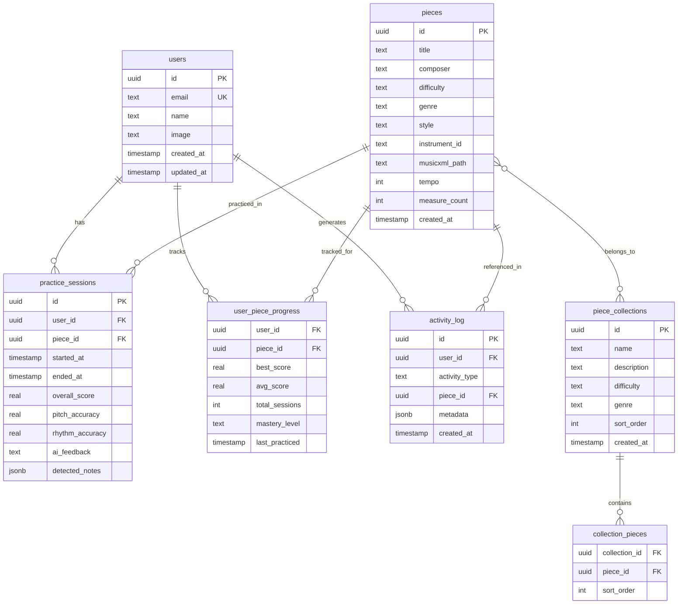
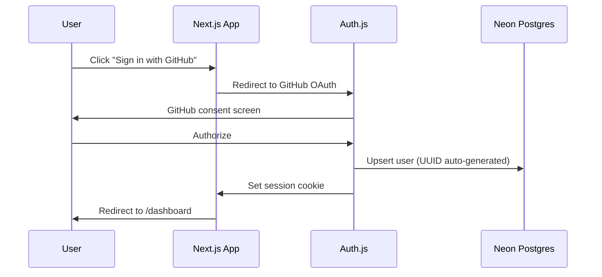

# AI Music Teacher - Revised Architecture Plan (v2)

## Tech Stack (Revised)

- **Framework**: Next.js 15, App Router, TypeScript
- **Styling**: Tailwind CSS (hand-built components, no UI library)
- **Linter/Formatter**: Biome.js
- **ORM**: Drizzle ORM + `@neondatabase/serverless` driver
- **Database**: Neon Postgres (hosted on Vercel)
- **Auth**: Auth.js v5 (NextAuth) with GitHub OAuth (portfolio-friendly, one-click)
- **Sheet Music**: OpenSheetMusicDisplay (OSMD) rendering MusicXML
- **Audio**: Web Audio API + WASAM for pitch detection
- **3D Avatar**: React Three Fiber + Drei + Mixamo animations
- **AI Feedback**: Ollama (local) via API route
- **State**: Zustand (client-side session state only; persistent data goes to DB)

---

## App Router Structure (Optimized)

```
src/app/
├── layout.tsx                              # Root layout (fonts, global providers)
├── page.tsx                                # Public landing page
├── globals.css                             # Global styles, Tailwind directives, CSS variables
│
├── (auth)/                                 # Route group: auth pages (minimal layout)
│   ├── layout.tsx                          # Centered card layout, no sidebar
│   ├── login/
│   │   └── page.tsx                        # Login page (GitHub OAuth button)
│   └── signup/
│       └── page.tsx                        # Optional signup flow
│
├── (app)/                                  # Route group: authenticated app
│   ├── layout.tsx                          # App shell (sidebar nav, header, auth guard)
│   │
│   ├── dashboard/
│   │   ├── page.tsx                        # Dashboard overview
│   │   ├── @history/
│   │   │   └── default.tsx                 # Parallel route: recent activity feed
│   │   └── @progress/
│   │       └── default.tsx                 # Parallel route: progress summary cards
│   │
│   ├── library/
│   │   ├── page.tsx                        # Browse all pieces (grid/list)
│   │   ├── loading.tsx                     # Skeleton loader
│   │   ├── [genre]/
│   │   │   └── page.tsx                    # Dynamic: filter by genre
│   │   └── @modal/
│   │       ├── default.tsx                 # Empty default (no modal open)
│   │       └── (..)piece/[pieceId]/
│   │           └── page.tsx                # Intercepting route: piece preview modal
│   │
│   ├── piece/
│   │   └── [pieceId]/
│   │       ├── page.tsx                    # Full piece detail (direct URL)
│   │       ├── loading.tsx                 # Piece loading skeleton
│   │       └── practice/
│   │           └── page.tsx                # Practice session (sheet music + audio + avatar)
│   │
│   └── history/
│       ├── page.tsx                        # Full history log (paginated)
│       └── loading.tsx
│
└── api/
    ├── auth/[...nextauth]/
    │   └── route.ts                        # Auth.js catch-all
    ├── feedback/
    │   └── route.ts                        # POST: Ollama feedback proxy
    └── progress/
        └── route.ts                        # GET/POST: user progress
```

**App Router features used:**

- **Route groups** `(auth)` / `(app)` -- separate layouts for auth vs main app without affecting URL
- **Parallel routes** `@history` / `@progress` -- dashboard loads history feed and progress cards independently and in parallel, each with its own loading/error states
- **Intercepting routes** `(..)piece/[pieceId]` -- clicking a piece in the library opens a preview modal (intercepted); refreshing or navigating directly to `/piece/[pieceId]` renders the full page
- **Dynamic routes** `[genre]`, `[pieceId]` -- standard dynamic segments
- **Loading boundaries** -- per-route `loading.tsx` skeletons for streaming SSR

---

## Database Schema (Neon Postgres via Drizzle)




**Key design decisions:**

- `user_piece_progress` is a materialized view of progress per piece -- updated after each practice session via a DB trigger or app-level logic. Enables fast dashboard queries.
- `piece_collections` groups pieces (e.g., "Beginner Classical", "Spanish Guitar Essentials") for displaying grouped progress.
- `mastery_level` is computed from scores: `learning` (0-3 sessions), `practicing` (avg < 70%), `comfortable` (avg 70-89%), `mastered` (avg 90%+).
- `activity_log` powers the history feed. Types: `practice_started`, `practice_completed`, `piece_unlocked`, `milestone_reached`.
- Schema supports future gamification (add XP, streaks, achievements tables later).

---

## Sheet Music Strategy

**MVP approach: Bundled MusicXML files rendered by OSMD**

1. Source 5-8 beginner classical guitar pieces from public domain (IMSLP) or create them in [MuseScore](https://musescore.org) (free, exports MusicXML)
2. Store `.musicxml` files in `src/_data/pieces/` and seed piece metadata to Neon DB
3. OSMD renders them in the browser with full notation, key signatures, time signatures
4. During practice: OSMD API highlights the current measure
5. After analysis: overlay correct (green) / incorrect (red) notes on the score

**Starter pieces (single-note melodies for reliable pitch detection):**

- Ode to Joy (Beethoven) -- very beginner
- Romanza (Anonymous) -- beginner
- Greensleeves -- beginner/intermediate
- Lagrima (Tarrega) -- intermediate
- Estudio in A minor (Tarrega) -- intermediate

**Future CMS feature (noted, not built in MVP):**
A content management interface where you can upload MusicXML, PDF, or audio files, tag them with metadata (difficulty, genre, instrument), and have them appear in the library. Could also support community uploads. This would replace the bundled file approach.

---

## Project File Structure (Revised)

```
music-teacher/
├── biome.json                              # Biome config (linting + formatting)
├── tailwind.config.ts                      # Tailwind config (theme, plugins)
├── drizzle.config.ts                       # Drizzle ORM config
├── next.config.ts
├── package.json
├── tsconfig.json
│
├── drizzle/                                # DB migrations (auto-generated)
│   └── 0000_initial.sql
│
├── public/
│   ├── models/                             # 3D character .glb files
│   └── animations/                         # Mixamo animation .glb clips
│
├── src/
│   ├── app/                                # (see App Router section above)
│   │
│   ├── _components/                        # All hand-built, no UI library
│   │   ├── common/                         # Button, Input, Card, Modal, etc.
│   │   │   ├── Button.tsx
│   │   │   ├── Modal.tsx
│   │   │   └── ...
│   │   ├── sheet-music/
│   │   │   ├── SheetMusicViewer.tsx
│   │   │   └── NoteOverlay.tsx
│   │   ├── audio/
│   │   │   ├── AudioControls/
│   │   │   ├── AudioVisualizer/
│   │   │   └── TuningHelper/
│   │   ├── avatar/
│   │   │   ├── AvatarScene/
│   │   │   └── AvatarController/
│   │   ├── feedback/
│   │   │   ├── FeedbackPanel/
│   │   │   └── ScoreBreakdown/
│   │   ├── dashboard/
│   │   │   ├── HistoryFeed/
│   │   │   └── ProgressCard/
│   │   └── layout/
│   │       ├── Sidebar/
│   │       ├── Header/
│   │       └── AppShell/
│   │
│   ├── _lib/
│   │   ├── audio/
│   │   │   ├── capture.ts                  # Mic → MediaStream → AudioWorklet
│   │   │   ├── pitch-detector.ts           # Pitchy wrapper
│   │   │   ├── note-detector.ts            # Onset/offset detection
│   │   │   └── analyzer.ts                 # Score computation
│   │   ├── music/
│   │   │   ├── theory.ts                   # Note math, frequencies, intervals
│   │   │   ├── instruments.ts              # Instrument registry configs
│   │   │   ├── musicxml-parser.ts          # Extract expected notes from MusicXML
│   │   │   └── comparison.ts               # Detected vs expected comparison
│   │   ├── ai/
│   │   │   ├── ollama-client.ts            # HTTP client for Ollama
│   │   │   └── prompts.ts                  # System prompts for music teacher persona
│   │   ├── three/
│   │   │   ├── animations.ts               # Load/manage animation clips
│   │   │   └── gesture-map.ts              # Score ranges → animation names
│   │   └── db/
│   │       ├── schema.ts                   # Drizzle schema definitions
│   │       ├── client.ts                   # Neon connection + drizzle instance
│   │       ├── queries/
│   │       │   ├── pieces.ts               # Piece CRUD queries
│   │       │   ├── progress.ts             # Progress read/update queries
│   │       │   ├── sessions.ts             # Practice session queries
│   │       │   └── activity.ts             # Activity log queries
│   │       └── seed.ts                     # Seed pieces + collections
│   │
│   ├── _stores/
│   │   ├── session-store.ts                # Live practice session state (Zustand)
│   │   └── settings-store.ts               # User prefs (instrument, theme)
│   │
│   ├── _types/
│   │   ├── music.ts                        # Instrument, Piece, Collection
│   │   ├── audio.ts                        # DetectedNote, PitchDetectionConfig
│   │   └── feedback.ts                     # AccuracyReport, FeedbackResponse
│   │
│   ├── _interfaces/                        # Shared interfaces (API contracts)
│   │   └── index.ts
│   │
│   ├── _utils/                             # Pure helper functions
│   │   └── index.ts
│   │
│   ├── _constants/                         # App constants, config values
│   │   └── index.ts
│   │
│   ├── _hooks/                             # React hooks
│   │   ├── use-sidebar.tsx
│   │   └── use-media-query.ts
│   │
│   └── _data/
│       ├── instruments/                    # Instrument configs
│       │   └── acoustic-guitar.ts          # Guitar config
│       └── pieces/                         # Bundled MusicXML files
│           ├── ode-to-joy.musicxml
│           ├── romanza.musicxml
│           └── greensleeves.musicxml
│
└── README.md
```

---

## Auth Flow




Auth.js v5 with the **Drizzle adapter** handles user table management automatically. GitHub OAuth is one-click for developers viewing your portfolio. The adapter auto-generates UUIDs and manages the `users`, `accounts`, and `sessions` tables.

---

## History Log Feature

The history log is powered by the `activity_log` table and surfaced in two places:

1. **Dashboard parallel route** (`@history/default.tsx`) -- shows the 5 most recent activities as a compact feed
2. **Dedicated history page** (`/history`) -- full paginated log with filters

Activity types logged:

- `practice_completed` -- "Practiced Ode to Joy - Score: 82%"
- `new_best_score` -- "New personal best on Romanza! 91%"
- `piece_started` -- "Started learning Lagrima"
- `mastery_reached` -- "Mastered Ode to Joy"

Each activity row stores a `metadata` JSONB field for flexible data (scores, durations, etc.) so we can enrich the display without schema changes.

---

## Build Phases (Revised)

### Phase 1: Foundation

- Initialize Next.js 15 with TypeScript, Tailwind CSS, Biome.js
- Set up the full App Router structure (route groups, parallel routes, layouts)
- Configure Neon + Drizzle ORM, define schema, run initial migration
- Set up Auth.js v5 with GitHub OAuth + Drizzle adapter
- Build core layout components: `AppShell`, `Sidebar`, `Header` (Tailwind)
- Build common components: `Button`, `Card`, `Input`, `Modal`
- Implement login flow and protected route middleware
- Seed DB with initial piece metadata

### Phase 2: Sheet Music + Library

- Integrate OSMD, build `SheetMusicViewer` component
- Build MusicXML parser to extract expected note sequences
- Source/create 5+ beginner classical guitar MusicXML files
- Build library page with genre filtering (`[genre]` dynamic route)
- Build piece detail page (`[pieceId]`)
- Implement intercepting route for piece preview modal in library
- Wire up piece data from Neon DB

### Phase 3: Audio Pipeline + Practice

- Implement mic capture with Web Audio API
- Integrate Pitchy for pitch detection
- Build note onset/offset detector
- Build performance comparison engine (detected vs expected)
- Create the practice session page with `AudioControls` and live visualizer
- Save practice sessions to DB
- Update `user_piece_progress` after each session

### Phase 4: 3D Avatar + Feedback

- Set up React Three Fiber scene
- Source rigged character (Ready Player Me / Mixamo)
- Download and integrate 4-6 Mixamo animations
- Build animation state machine mapping scores to gestures
- Integrate Ollama for AI text feedback
- Build `FeedbackPanel` and `ScoreBreakdown` components
- Graceful fallback when Ollama is not running

### Phase 5: Dashboard + History

- Build dashboard with parallel routes (`@history`, `@progress`)
- Implement `HistoryFeed` component reading from `activity_log`
- Implement `ProgressCard` components showing per-piece and per-collection progress
- Build full history page with pagination and filters
- Log all activity types from practice sessions

### Phase 6: Polish + Ship

- Landing page with hero, feature highlights, architecture overview
- Dark/light theme via Tailwind's `dark:` variant + CSS custom properties
- Responsive layout for the non-practice pages
- Comprehensive README: setup guide, architecture diagram, screenshots/GIF, tech decisions
- GitHub Actions CI: Biome check + TypeScript type-check + build
- DB seed script for easy onboarding

---

## Key Technical Notes

1. **Imports** — All shared code lives in `_`-prefixed folders (`_components`, `_lib`, `_types`, `_hooks`, `_stores`, `_data`, `_utils`, `_constants`, `_interfaces`). Use `@_*` path aliases and barrel files (`index.ts`) for clean imports. See README for details.
2. **Pitch detection is monophonic only for MVP** -- start with single-note melodies. Chord detection is a much harder problem and can be a future enhancement.
3. **OSMD is a large library (~2MB)** -- dynamically import it only on the practice/piece pages to keep the initial bundle small. Use `next/dynamic` with `ssr: false` since OSMD needs the DOM.
4. **3D scene isolation** -- render the R3F canvas only on the practice page, lazy-loaded. Run audio analysis in a Web Worker to avoid competing with the Three.js render loop.
5. **Neon serverless driver** -- use `@neondatabase/serverless` for edge-compatible connections. Works seamlessly with Vercel's edge runtime.
6. **Biome.js configuration** -- enforce consistent formatting (tabs vs spaces, semicolons, quotes) project-wide. Set up a `biome.json` at root with recommended rules plus any custom preferences.
7. **Future CMS note** -- for now, pieces are bundled as static MusicXML files and seeded to the DB. A future admin interface could allow uploading MusicXML/PDF/audio, auto-extracting metadata, and managing the piece catalog. The schema already supports this -- just needs a UI and file storage (Vercel Blob or S3).

