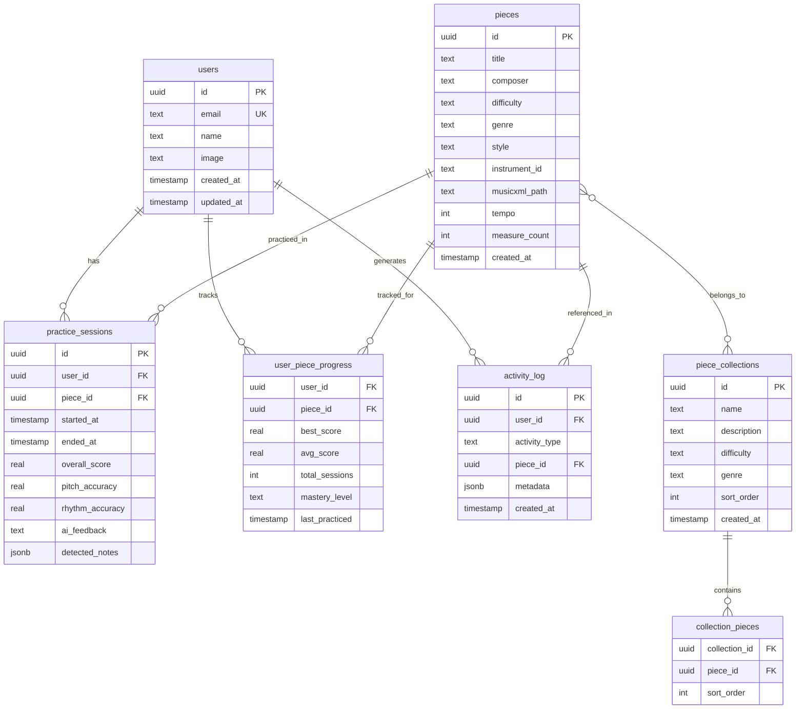
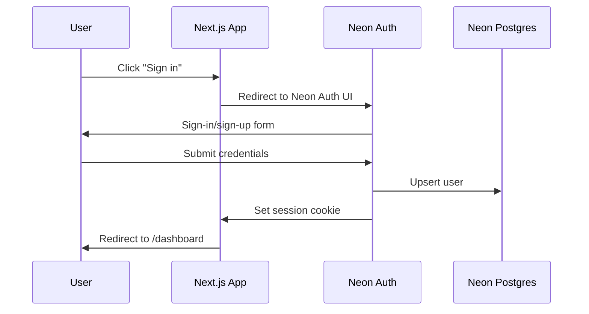

# AI Music Teacher - Revised Architecture Plan (v2)

## Tech Stack (Revised)

- **Framework**: Next.js 16, App Router, TypeScript, React 19
- **Styling**: Tailwind CSS v4 (hand-built components, no UI library)
- **Linter/Formatter**: Biome.js 2
- **ORM**: Drizzle ORM + `@vercel/postgres` driver
- **Database**: Neon Postgres (hosted on Vercel)
- **Auth**: Neon Auth (Vercel integration, cookie-based sessions)
- **Sheet Music**: OpenSheetMusicDisplay (OSMD) rendering MusicXML
- **Audio**: Web Audio API + WASM (Rust/wasm-pack, YIN algorithm) for low-latency pitch detection
- **3D Avatar**: React Three Fiber + Drei + Mixamo animations
- **AI Feedback**: Ollama (local) via API route
- **State**: Zustand (client-side session state only; persistent data goes to DB)

---

## App Router Structure (Optimized)

```
src/app/
├── layout.tsx                              # Root layout (fonts, global providers)
├── page.tsx                                # Public landing page
├── globals.css                             # Global styles, Tailwind directives, CSS variables
│
├── (auth)/                                 # Route group: auth pages (minimal layout)
│   ├── layout.tsx                          # Centered card layout, no sidebar
│   ├── login/
│   │   └── page.tsx                        # Redirects to /auth/sign-in
│   ├── signup/
│   │   └── page.tsx                        # Redirects to /auth/sign-up
│   ├── auth/[pathname]/
│   │   └── page.tsx                        # Neon Auth UI wrapper
│   └── account/[pathname]/
│       └── page.tsx                        # Account management
│
├── (app)/                                  # Route group: authenticated app
│   ├── layout.tsx                          # App shell (sidebar nav, header, auth guard)
│   │
│   ├── dashboard/
│   │   ├── page.tsx                        # Dashboard overview
│   │   ├── @history/
│   │   │   └── default.tsx                 # Parallel route: recent activity feed
│   │   └── @progress/
│   │       └── default.tsx                 # Parallel route: progress summary cards
│   │
│   ├── library/
│   │   ├── page.tsx                        # Browse all pieces (grid/list)
│   │   ├── loading.tsx                     # Skeleton loader
│   │   ├── [genre]/
│   │   │   └── page.tsx                    # Dynamic: filter by genre
│   │   └── @modal/
│   │       ├── default.tsx                 # Empty default (no modal open)
│   │       └── (..)piece/[pieceId]/
│   │           └── page.tsx                # Intercepting route: piece preview modal
│   │
│   ├── piece/
│   │   └── [pieceId]/
│   │       ├── page.tsx                    # Full piece detail (direct URL)
│   │       ├── loading.tsx                 # Piece loading skeleton
│   │       └── practice/
│   │           └── page.tsx                # Practice session (sheet music + audio + avatar)
│   │
│   ├── history/
│   │   ├── page.tsx                        # Full history log (paginated)
│   │   └── loading.tsx
│   │
│   ├── settings/
│   │   └── page.tsx                        # User settings (theme, instrument prefs)
│   │
│   └── manage/
│       └── page.tsx                        # Admin piece management
│
├── (cms)/                                  # Route group: public CMS pages
│   ├── layout.tsx                          # Public nav wrapper
│   └── [...slug]/
│       └── page.tsx                        # Dynamic CMS pages
│
└── api/
    ├── auth/[...path]/
    │   └── route.ts                        # Neon Auth catch-all (GET/POST/PUT/DELETE/PATCH)
    ├── feedback/
    │   └── route.ts                        # POST: Ollama feedback proxy
    └── progress/
        └── route.ts                        # GET/POST: user progress
```

**App Router features used:**

- **Route groups** `(auth)` / `(app)` -- separate layouts for auth vs main app without affecting URL
- **Parallel routes** `@history` / `@progress` -- dashboard loads history feed and progress cards independently and in parallel, each with its own loading/error states
- **Intercepting routes** `(..)piece/[pieceId]` -- clicking a piece in the library opens a preview modal (intercepted); refreshing or navigating directly to `/piece/[pieceId]` renders the full page
- **Dynamic routes** `[genre]`, `[pieceId]` -- standard dynamic segments
- **Loading boundaries** -- per-route `loading.tsx` skeletons for streaming SSR

---

## Database Schema (Neon Postgres via Drizzle)




**Key design decisions:**

- `user_piece_progress` is a materialized view of progress per piece -- updated after each practice session via a DB trigger or app-level logic. Enables fast dashboard queries.
- `piece_collections` groups pieces (e.g., "Beginner Classical", "Spanish Guitar Essentials") for displaying grouped progress.
- `mastery_level` is computed from scores: `learning` (0-3 sessions), `practicing` (avg < 70%), `comfortable` (avg 70-89%), `mastered` (avg 90%+).
- `activity_log` powers the history feed. Types: `practice_started`, `practice_completed`, `piece_unlocked`, `milestone_reached`.
- Schema supports future gamification (add XP, streaks, achievements tables later).

---

## Sheet Music Strategy

**MVP approach: Bundled MusicXML files rendered by OSMD**

1. Source 5-8 beginner classical guitar pieces from public domain (IMSLP) or create them in [MuseScore](https://musescore.org) (free, exports MusicXML)
2. Store `.musicxml` files in `public/pieces/` (served as static files) and seed piece metadata to Neon DB
3. OSMD renders them in the browser with full notation, key signatures, time signatures
4. During practice: OSMD API highlights the current measure
5. After analysis: overlay correct (green) / incorrect (red) notes on the score

**Starter pieces (single-note melodies for reliable pitch detection):**

- Ode to Joy (Beethoven) -- beginner, classical
- Romanza / Spanish Romance (Anonymous) -- beginner, classical
- Greensleeves (Traditional English) -- beginner, folk
- Malagueña (Traditional Spanish) -- beginner, latin
- Lágrima (Tárrega) -- intermediate, classical
- Estudio in A minor (Tárrega) -- intermediate, classical
- Adelita (Tárrega) -- intermediate, classical

**Future CMS feature (noted, not built in MVP):**
A content management interface where you can upload MusicXML, PDF, or audio files, tag them with metadata (difficulty, genre, instrument), and have them appear in the library. Could also support community uploads. This would replace the bundled file approach.

---

## Project File Structure (Revised)

```
music-teacher/
├── biome.json                              # Biome config (linting + formatting)
├── tailwind.config.ts                      # Tailwind config (theme, plugins)
├── drizzle.config.ts                       # Drizzle ORM config
├── next.config.ts
├── package.json
├── tsconfig.json
│
├── drizzle/                                # DB migrations (auto-generated)
│   └── 0000_initial.sql
│
├── public/
│   ├── models/                             # 3D character .glb files
│   └── animations/                         # Mixamo animation .glb clips
│
├── src/
│   ├── app/                                # (see App Router section above)
│   │
│   ├── _components/                        # All hand-built, no UI library
│   │   ├── common/                         # Button, Input, Card, Modal, Badge, etc.
│   │   │   ├── Button.tsx
│   │   │   ├── Modal.tsx
│   │   │   └── ...
│   │   ├── library/
│   │   │   ├── PieceCard.tsx
│   │   │   └── GenreFilter.tsx
│   │   ├── sheet-music/
│   │   │   ├── SheetMusicViewer.tsx
│   │   │   └── NoteOverlay.tsx
│   │   ├── audio/
│   │   │   ├── AudioControls/
│   │   │   ├── AudioVisualizer/
│   │   │   └── TuningHelper/
│   │   ├── avatar/
│   │   │   ├── AvatarScene/
│   │   │   └── AvatarController/
│   │   ├── feedback/
│   │   │   ├── FeedbackPanel/
│   │   │   └── ScoreBreakdown/
│   │   ├── dashboard/
│   │   │   ├── HistoryFeed/
│   │   │   └── ProgressCard/
│   │   └── layout/
│   │       ├── Sidebar/
│   │       ├── Header/
│   │       └── AppShell/
│   │
│   ├── _lib/
│   │   ├── audio/
│   │   │   ├── capture.ts                  # Mic → MediaStream → AudioWorklet
│   │   │   ├── pitch-detector.ts           # WASM pitch detector wrapper (YIN algorithm)
│   │   │   ├── note-detector.ts            # Onset/offset detection
│   │   │   └── analyzer.ts                 # Score computation
│   │   ├── music/
│   │   │   ├── theory.ts                   # Note math, frequencies, intervals
│   │   │   ├── instruments.ts              # Instrument registry configs
│   │   │   ├── musicxml-parser.ts          # Extract expected notes from MusicXML
│   │   │   └── comparison.ts               # Detected vs expected comparison
│   │   ├── ai/
│   │   │   ├── ollama-client.ts            # HTTP client for Ollama
│   │   │   └── prompts.ts                  # System prompts for music teacher persona
│   │   ├── three/
│   │   │   ├── animations.ts               # Load/manage animation clips
│   │   │   └── gesture-map.ts              # Score ranges → animation names
│   │   └── db/
│   │       ├── schema.ts                   # Drizzle schema definitions
│   │       ├── client.ts                   # Neon connection + drizzle instance
│   │       ├── queries/
│   │       │   ├── pieces.ts               # Piece CRUD queries
│   │       │   ├── progress.ts             # Progress read/update queries
│   │       │   ├── sessions.ts             # Practice session queries
│   │       │   └── activity.ts             # Activity log queries
│   │       └── seed.ts                     # Seed pieces + collections
│   │
│   ├── _stores/
│   │   ├── session-store.ts                # Live practice session state (Zustand)
│   │   └── settings-store.ts               # User prefs (instrument, theme)
│   │
│   ├── _types/
│   │   ├── music.ts                        # Instrument, Piece, Collection
│   │   ├── audio.ts                        # DetectedNote, PitchDetectionConfig
│   │   └── feedback.ts                     # AccuracyReport, FeedbackResponse
│   │
│   ├── _interfaces/                        # Shared interfaces (API contracts)
│   │   └── index.ts
│   │
│   ├── _utils/                             # Pure helper functions
│   │   └── index.ts
│   │
│   ├── _constants/                         # App constants, config values
│   │   └── index.ts
│   │
│   ├── _hooks/                             # React hooks
│   │   ├── use-sidebar.tsx
│   │   ├── use-media-query.ts
│   │   └── use-microphone.ts               # Mic capture lifecycle (start/stop/state)
│   │
│   └── _data/
│       └── instruments/                    # Instrument configs
│           └── acoustic-guitar.ts          # Guitar config
│
├── public/
│   └── pieces/                             # Static MusicXML files (served at /pieces/*)
│       ├── ode-to-joy.musicxml
│       ├── romanza.musicxml
│       ├── greensleeves.musicxml
│       ├── lagrima.musicxml
│       ├── estudio-am.musicxml
│       ├── malaguena.musicxml
│       └── adelita.musicxml
│
└── README.md
```

---

## Auth Flow




Neon Auth (via Vercel integration) handles user authentication with cookie-based sessions. The `@neondatabase/neon-js` client provides server-side session access via `auth.getSession()`. Routes under `(app)/` are protected by the layout-level auth guard.

---

## History Log Feature

The history log is powered by the `activity_log` table and surfaced in two places:

1. **Dashboard parallel route** (`@history/default.tsx`) -- shows the 5 most recent activities as a compact feed
2. **Dedicated history page** (`/history`) -- full paginated log with filters

Activity types logged:

- `practice_completed` -- "Practiced Ode to Joy - Score: 82%"
- `new_best_score` -- "New personal best on Romanza! 91%"
- `piece_started` -- "Started learning Lagrima"
- `mastery_reached` -- "Mastered Ode to Joy"

Each activity row stores a `metadata` JSONB field for flexible data (scores, durations, etc.) so we can enrich the display without schema changes.

---

## Build Phases (Revised)

### Phase 1: Foundation (COMPLETED)

- Initialize Next.js 16 with TypeScript, Tailwind CSS v4, Biome.js 2
- Set up the full App Router structure (route groups, parallel routes, layouts)
- Configure Neon + Drizzle ORM (`@vercel/postgres` driver), define schema
- Set up Neon Auth with cookie-based sessions
- Build core layout components: `AppShell`, `Sidebar`, `Header`, `MobileBottomNav`, `Footer` (Tailwind)
- Build common components: `Button`, `Card`, `Input`, `Modal`, `Badge`, `Accordion`, `Separator`, `ScrollWindow`
- Implement login flow and layout-level auth guard
- Landing page with hero section and feature highlights
- Dark/light theme system with cookie persistence

### Phase 2: Sheet Music + Library (COMPLETED)

- Integrated OSMD (`opensheetmusicdisplay@1.9.7`), built `SheetMusicViewer` component with dynamic import, loading/error states, and retry
- Built MusicXML parser to extract expected note sequences (pitch, octave, beat position, duration)
- Created 7 beginner/intermediate classical guitar MusicXML files in `public/pieces/`
- Built library page with `GenreFilter` (pill tabs) and `PieceCard` grid
- Built `[genre]` dynamic route page with filtered pieces from DB
- Built piece detail page with OSMD sheet music preview, metadata cards, and practice link
- Implemented intercepting route modal (`@modal/(..)piece/[pieceId]`) with `ModalOverlay` (backdrop dismiss, ESC key, close button)
- Wired up piece queries (`getAllPieces`, `getPieceById`, `getPiecesByGenre`, `getAvailableGenres`)
- Built seed script (`bun run seed`) to populate pieces and collections

### Phase 3: Audio Pipeline + Practice

- ~~Implement mic capture with Web Audio API (AudioContext → AnalyserNode pipeline, `useMicrophone` hook)~~ ✅
- ~~Build WASM pitch detector (Rust/wasm-pack YIN algorithm, JS fallback, `PitchDetector` class, `usePitchDetection` hook, live `PitchDisplay` tuning meter)~~ ✅
- ~~Build note onset/offset detector (`NoteDetector` state machine, `useNoteDetection` hook, note log UI)~~ ✅
- ~~Build performance comparison engine (detected vs expected)~~ ✅
- ~~Create the practice session page with `AudioControls` and live visualizer~~ ✅
- ~~Save practice sessions to DB~~ ✅
- ~~Update `user_piece_progress` after each session~~ ✅

### Phase 4: 3D Avatar + Feedback (COMPLETED)

- ~~Set up React Three Fiber scene (Canvas, lighting, environment, OrbitControls)~~ ✅
- ~~Universal 3D model support — users upload any `.glb` model (shark, Roblox character, etc.) as their avatar teacher~~ ✅
- ~~Default procedural avatar (capsule body + eyes) for users without a custom model~~ ✅
- ~~Transform-based reaction system (bounce, wobble, glow, scale pulse, spin) — works with ANY model, no skeleton required~~ ✅
- ~~Live note-by-note avatar reactions: good_note (green glow + bounce), bad_note (red flash + wobble), great_streak (gold glow + spin), celebrating (big bounce + particles)~~ ✅
- ~~Reaction particle effects (instanced mesh sparkles for good/great/celebrating moods)~~ ✅
- ~~Model upload via `.glb` file input, persisted to IndexedDB + localStorage~~ ✅
- ~~AvatarController bridges live note detection → mood → avatar transforms~~ ✅
- ~~Integrate Ollama for AI text feedback with graceful fallback when Ollama is not running~~ ✅
- ~~Build enhanced `FeedbackPanel` with suggestions, encouragement, and focus areas~~ ✅
- ~~`/api/feedback` route proxies to Ollama, returns structured JSON feedback~~ ✅
- ~~Score-based fallback feedback when Ollama is unavailable~~ ✅

### Phase 5: Dashboard + History

- Build dashboard with parallel routes (`@history`, `@progress`)
- Implement `HistoryFeed` component reading from `activity_log`
- Implement `ProgressCard` components showing per-piece and per-collection progress
- Build full history page with pagination and filters
- Log all activity types from practice sessions

### Phase 6: Polish + Ship

- Landing page with hero, feature highlights, architecture overview
- Dark/light theme via Tailwind's `dark:` variant + CSS custom properties
- Responsive layout for the non-practice pages
- Comprehensive README: setup guide, architecture diagram, screenshots/GIF, tech decisions
- GitHub Actions CI: Biome check + TypeScript type-check + build
- DB seed script for easy onboarding

---

## WASM Pitch Detection Architecture

```
Audio Pipeline (mic capture → pitch detection):

  Microphone
      │
      ▼
  getUserMedia({ audio: { echoCancellation: false, noiseSuppression: false, autoGainControl: false } })
      │
      ▼
  AudioContext (44100 Hz)
      │
      ▼
  MediaStreamSourceNode
      │
      ▼
  AnalyserNode (fftSize: 2048)
      │
      ▼
  getFloatTimeDomainData() → Float32Array (called per animation frame)
      │
      ▼
  WASM Pitch Detector (Rust, YIN algorithm)
      │
      ▼
  { frequency: f32, clarity: f32 }
      │
      ▼
  frequencyToNote() → { name, octave, cents }
      │
      ▼
  Note Onset/Offset Detector → DetectedNote[]
```

**Why WASM over a JS pitch detection library (e.g. Pitchy)?**

- **Lower latency**: YIN algorithm in Rust/WASM runs 3-5x faster than equivalent JS, critical for real-time feedback
- **Deterministic performance**: No GC pauses during pitch analysis; consistent frame timing
- **Future-proof**: AudioWorklet + WASM enables off-main-thread processing (Phase 3 optimization)
- **Precision**: Rust's f32/f64 math compiles to native WASM float ops without JS number coercion edge cases

**WASM module interface** (Rust → wasm-bindgen exports):

```rust
#[wasm_bindgen]
pub fn detect_pitch(samples: &[f32], sample_rate: f32, threshold: f32) -> JsValue
// Returns { frequency: f32, clarity: f32 } or null if no pitch detected
```

**Build pipeline**: `wasm-pack build --target bundler` → generates ES module imported by `pitch-detector.ts`

---

## Ollama Live Feedback Architecture

### Overview

Ollama provides two modes of AI feedback during practice:

1. **Live micro-feedback** (streaming, during practice) — short 1-sentence messages displayed in a Twitch chat-style overlay below the avatar
2. **Post-session summary** (non-streaming, after practice) — structured JSON feedback in the `FeedbackPanel`

### Ollama Configuration

- **Default URL**: `http://localhost:11434` (override via `OLLAMA_URL` env var)
- **Model**: `llama3.2` (local, ~2GB download on first use)
- **Health check**: `GET /api/tags` with 3s timeout before any generation request
- **Fallback**: When Ollama is unavailable, both modes return pre-written score-based/trigger-based fallback messages

### Streaming Pipeline

```
Practice Session (client)
    │
    ▼
useLiveFeedback hook
    │  ── detects triggers (periodic 15s, good streak 5+, bad streak 3+)
    │  ── enforces 8s cooldown, 1 in-flight max
    │
    ▼
POST /api/feedback/stream
    │  ── health check → fallback if Ollama down
    │  ── builds short-form prompt (trigger, recent notes, accuracy)
    │
    ▼
Ollama /api/generate (stream: true)
    │  ── NDJSON: { "response": "token", "done": false }
    │
    ▼
ReadableStream proxied to client
    │
    ▼
LiveFeedbackChat component
    ── accumulates tokens → completed message
    ── auto-scrolls, fades old messages
    ── transparent bg, Twitch chat aesthetic
```

### Trigger System

| Trigger | Condition | Cooldown | Prompt Tone |
|---|---|---|---|
| `periodic` | Every ~15s of playing | 8s min | Observational, varied |
| `good_streak` | 5+ correct notes in row | 8s min | Celebratory |
| `bad_streak` | 3+ wrong notes in row | 8s min | Gentle coaching |
| `section_end` | Phrase boundary reached | 8s min | Section commentary |

Guardrails: maximum 1 in-flight request, triggers during cooldown are dropped.

### Prompt Design

**Live feedback** uses a separate system prompt optimized for brevity:
- 1 sentence max, 15 words or fewer
- Plain text output (no JSON)
- Receives: trigger reason, last ~10 notes (correct/incorrect), running accuracy %, piece title
- Previous message included to prevent repetition

**Post-session feedback** retains the existing structured JSON prompt (message, suggestions, encouragement, focusAreas).

### UI: LiveFeedbackChat (Twitch Chat Style)

- Transparent background, no card/border — floats below avatar in the right sidebar
- Fixed height (~200px), messages stack from bottom
- CSS mask gradient fades oldest messages at top
- New messages slide up with fade-in animation
- Streaming messages show token-by-token with blinking cursor
- Hidden scrollbar (`scrollbar-width: none`)
- Colored dot per message type (green = encouragement, yellow = tip, blue = coaching, gold = celebration)
- Max ~6-8 visible messages before recycling

### Key Files

| File | Purpose |
|---|---|
| `src/_lib/ai/ollama-client.ts` | HTTP client: `generateFeedback()` (non-stream) + `generateFeedbackStream()` (stream) |
| `src/_lib/ai/prompts.ts` | System prompts + prompt builders for both modes |
| `src/app/api/feedback/route.ts` | POST: non-streaming post-session feedback proxy |
| `src/app/api/feedback/stream/route.ts` | POST: streaming live feedback proxy |
| `src/_hooks/use-live-feedback.ts` | Client hook: trigger detection, cooldown, stream consumer |
| `src/_components/feedback/LiveFeedbackChat/` | Twitch chat UI component |
| `src/_components/feedback/FeedbackPanel/` | Post-session structured feedback panel |

---

## Key Technical Notes

1. **Imports** — All shared code lives in `_`-prefixed folders (`_components`, `_lib`, `_types`, `_hooks`, `_stores`, `_data`, `_utils`, `_constants`, `_interfaces`). Use `@_*` path aliases and barrel files (`index.ts`) for clean imports. See README for details.
2. **Pitch detection is monophonic only for MVP** -- start with single-note melodies. Uses a Rust-compiled WASM module implementing the YIN algorithm for sub-millisecond pitch detection. The WASM module is loaded as an ES module via wasm-pack's `bundler` target and invoked from the main thread (AudioWorklet integration is a future optimization). Chord detection is a much harder problem and can be a future enhancement.
3. **OSMD is a large library (~2MB)** -- dynamically import it only on the practice/piece pages to keep the initial bundle small. Use `next/dynamic` with `ssr: false` since OSMD needs the DOM.
4. **3D scene isolation** -- render the R3F canvas only on the practice page, lazy-loaded. Run audio analysis in a Web Worker to avoid competing with the Three.js render loop.
5. **Vercel Postgres driver** -- use `@vercel/postgres` which reads `POSTGRES_URL` from env automatically. Works seamlessly with Vercel's edge runtime.
6. **Biome.js configuration** -- enforce consistent formatting (tabs vs spaces, semicolons, quotes) project-wide. Set up a `biome.json` at root with recommended rules plus any custom preferences.
7. **Future CMS note** -- for now, pieces are bundled as static MusicXML files and seeded to the DB. A future admin interface could allow uploading MusicXML/PDF/audio, auto-extracting metadata, and managing the piece catalog. The schema already supports this -- just needs a UI and file storage (Vercel Blob or S3).

